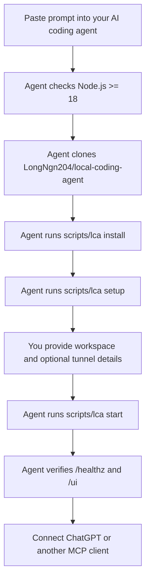
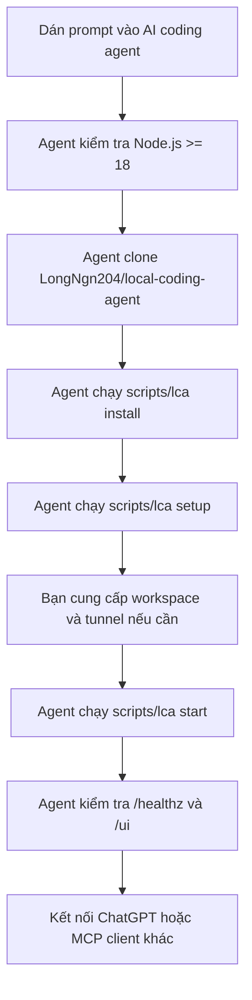

<div align="center">


<h1>Local Coding Agent</h1>

<p><b>Turn your machine into a local MCP coding workspace for AI agents.</b><br/>
Let an AI agent read files, edit code, run checks, inspect git, and show live health metrics from a local dashboard.</p>

<p>
  <a href="https://github.com/LongNgn204/local-coding-agent/releases"></a>
  
  
  <a href="LICENSE"></a>
  
  <a href="https://github.com/LongNgn204/local-coding-agent/stargazers"></a>
</p>

<p><b>Works with</b><br/>
  
  
  
  
</p>

<sub>Compatible with any MCP client. Not affiliated with Anthropic, OpenAI, GitHub, or Microsoft.</sub>

<p><b>English</b> | <a href="#tiếng-việt">Tiếng Việt</a></p>

</div>

> This tool can run commands on your computer. Read [SECURITY.md](SECURITY.md)
> before using it. It is not an OS sandbox; only connect workspaces you trust.

---

## English

### Install With Your AI Agent

The easiest path is to let a strong AI coding agent do the setup for you. Copy
this prompt into Codex, Claude Code, Cursor, or another local coding agent:

```text
Please install Local Coding Agent on my machine.

Repository:
https://github.com/LongNgn204/local-coding-agent

Goal:
Clone the repo, install it, configure a workspace, start the MCP server, and
verify the dashboard.

Rules:
- Do not install system dependencies without asking me first.
- Do not download, commit, or redistribute tunnel-client. I will provide it if needed.
- Do not commit secrets, API keys, tunnel IDs, local config, or generated profiles.
- Default to mode=safe and policy=balanced.
- Use the universal CLI first. Use the Windows tray app only if I ask for GUI.
- If anything fails, show the exact error and the next command to fix it.

Steps:
1. Check Node.js version is >= 18.
2. Clone https://github.com/LongNgn204/local-coding-agent if it is not already cloned.
3. Enter the repo directory.
4. Install with:
   - Windows: scripts\lca.cmd install
   - macOS/Linux: bash scripts/lca install
5. Run setup with:
   - Windows: scripts\lca.cmd setup
   - macOS/Linux: bash scripts/lca setup
6. Ask me for the workspace folder the AI may access.
7. If I want ChatGPT Web tunnel access, ask me for tunnel-client path, tunnel ID,
   organization ID if required, and Runtime API key.
8. Start with:
   - Windows: scripts\lca.cmd start
   - macOS/Linux: bash scripts/lca start
9. Verify:
   - http://127.0.0.1:8787/healthz returns status ok
   - http://127.0.0.1:8790/ui opens the dashboard
   - status command works
10. Report the MCP URL, dashboard URL, workspace path, mode, policy, and tunnel status.
```

More prompt variants are in [docs/AI_AGENT_SETUP_PROMPT.md](docs/AI_AGENT_SETUP_PROMPT.md).

### Setup Map



### Manual Quickstart

Windows:

```powershell
git clone https://github.com/LongNgn204/local-coding-agent.git
cd local-coding-agent
scripts\lca.cmd install
scripts\lca.cmd setup
scripts\lca.cmd start
```

macOS / Linux:

```bash
git clone https://github.com/LongNgn204/local-coding-agent.git
cd local-coding-agent
bash scripts/lca install
bash scripts/lca setup
bash scripts/lca start
```

Open:

```text
http://127.0.0.1:8790/ui
```

Useful commands:

```text
status   show MCP URL, dashboard URL, process status
doctor   check local setup and common missing requirements
open     open the local dashboard
stop     stop the server and tunnel started by the CLI
logs     show launcher logs
url      print the MCP URL
```

### Windows Tray App

The Windows tray app is a GUI supervisor for the same local server and tunnel.
It can start/stop the server, save tunnel settings, copy the MCP URL, open the
dashboard, and store the Runtime API key encrypted with Windows DPAPI.

Download the self-contained `.exe` from
[Releases](https://github.com/LongNgn204/local-coding-agent/releases), or build
it yourself:

```powershell
cd tray-app
powershell -ExecutionPolicy Bypass -File build.ps1
```

The tray app is optional. The universal CLI is recommended for customers on
Windows, macOS, and Linux because it does not require building a GUI app.

### Connect To ChatGPT Web

1. Start the local server first and verify the dashboard.
2. Put the OpenAI tunnel client in `tools/tunnel-client.exe` on Windows or
   `tools/tunnel-client` on macOS/Linux.
3. Create or choose a tunnel in ChatGPT/OpenAI.
4. Provide the same Tunnel ID during `scripts/lca setup`.
5. Use a Runtime API key for `CONTROL_PLANE_API_KEY`. Do not use an Admin key.
6. If your organization requires it, provide the OpenAI Organization ID.
7. Start the CLI or tray app and keep it running while ChatGPT uses the tools.

The local URL `http://127.0.0.1:8787/mcp` is for your machine. ChatGPT Web must
connect through the secure tunnel, not by pasting the local loopback URL.

### Customer Network Diagnostics

If the customer says it works on mobile hotspot but fails on office/internal
network, ask them to run Network Doctor on the failing network and send the
redacted report.

Basic check:

```powershell
node scripts\network-doctor.mjs
```

Tunnel smoke test:

```powershell
$env:CONTROL_PLANE_API_KEY="sk-proj-..."
node scripts\network-doctor.mjs --tunnel-bin "tools\tunnel-client.exe" --tunnel-id "tunnel_..." --organization-id "org_..." --duration 30
```

Guide: [docs/NETWORK_DOCTOR.md](docs/NETWORK_DOCTOR.md).

### Features

| Area | What it does |
|---|---|
| Workspace | `workspace_info`, `workspace_snapshot`, `workspace_doctor`, `repo_map` |
| Files | `list_files`, `read_file`, `read_many`, `write_file`, `replace_in_file`, `apply_patch` |
| Search | `search_text`, `find_files`, `repo_symbols`, `important_files` |
| Commands | `run_command`, `run_commands`, `proc_start`, `proc_output`, `quality_gate` |
| Git | `git_status`, `git_diff`, `review_diff`, guarded `git` helper |
| Safety | `policy_status`, `explain_risk`, `request_approval`, `request_approval_batch` |
| Dashboard | health score, latency, tool calls, approvals, file viewer, git diff |
| Workflow | notes, checkpoints, session reports, task state, decision log, skills |

### Safety Defaults

Recommended defaults:

```text
AGENT_MODE=safe
AGENT_POLICY=balanced
DASHBOARD_PORT=8790
```

Security notes:

- File tools are confined to configured workspace roots.
- Command execution is not an OS sandbox.
- Use `safe` mode for customers unless they explicitly accept `full`.
- Use `balanced` policy so risky actions require local approval.
- Use `MCP_AUTH_TOKEN` when exposing the server through a tunnel.
- Do not commit API keys, tunnel profiles, generated config, or logs with secrets.
- Use a VM/container for untrusted repositories.

### Troubleshooting

| Problem | What to check |
|---|---|
| `node` not found | Install Node.js 18+ and reopen the terminal. |
| `server/node_modules is missing` | Run `scripts\lca.cmd install` or `bash scripts/lca install`. |
| Dashboard offline | Check `http://127.0.0.1:8787/healthz`, then run `status` or `doctor`. |
| Port conflict | Change `--port` or `--dashboard-port`; do not use `8788` for the dashboard. |
| `tunnel-client` not found | Put the user-supplied tunnel client in `tools/` or set its path in setup. |
| `tunnel_active_organization_required` | Provide the OpenAI Organization ID that owns the tunnel. |
| `401 Unauthorized` | Use a Runtime API key, not an Admin key; check organization/project access. |
| `poll failed` or `forcibly closed` | Run Network Doctor; office firewall/proxy may block tunnel/WebSocket traffic. |
| Edits appear in the wrong repo | Run `workspace_info` and confirm the exact workspace path. |

### Development

Server tests:

```bash
cd server
npm run test:agent
npm run test:pro
npm run test:security
npm run test:hardening
npm run eval
```

Tray app build:

```powershell
cd tray-app
dotnet build LocalCodingAgentTray.csproj -c Release
```

### License

[AGPL-3.0-or-later](LICENSE) © 2026 Long Nguyễn
([@LongNgn204](https://github.com/LongNgn204)).

---

## Tiếng Việt

### Cài Đặt Bằng AI Agent Của Bạn

Cách dễ nhất là để một AI coding agent mạnh làm phần setup giúp bạn. Copy prompt
này vào Codex, Claude Code, Cursor hoặc một local coding agent khác:

```text
Hãy cài Local Coding Agent trên máy của tôi.

Repository:
https://github.com/LongNgn204/local-coding-agent

Mục tiêu:
Clone repo, cài dependency, cấu hình workspace, khởi động MCP server và kiểm tra
dashboard.

Quy tắc:
- Không tự cài dependency hệ thống nếu chưa hỏi tôi trước.
- Không tải, commit hoặc phân phối lại tunnel-client. Tôi sẽ tự cung cấp nếu cần.
- Không commit secret, API key, Tunnel ID, local config hoặc generated profile.
- Mặc định dùng mode=safe và policy=balanced.
- Ưu tiên dùng universal CLI. Chỉ dùng Windows tray app nếu tôi yêu cầu GUI.
- Nếu lỗi, hãy báo đúng lỗi và lệnh tiếp theo để sửa.

Các bước:
1. Kiểm tra Node.js version >= 18.
2. Clone https://github.com/LongNgn204/local-coding-agent nếu repo chưa tồn tại.
3. Đi vào thư mục repo.
4. Cài đặt bằng:
   - Windows: scripts\lca.cmd install
   - macOS/Linux: bash scripts/lca install
5. Chạy setup bằng:
   - Windows: scripts\lca.cmd setup
   - macOS/Linux: bash scripts/lca setup
6. Hỏi tôi thư mục workspace mà AI được phép truy cập.
7. Nếu tôi muốn kết nối ChatGPT Web qua tunnel, hãy hỏi tunnel-client path,
   Tunnel ID, Organization ID nếu cần, và Runtime API key.
8. Khởi động bằng:
   - Windows: scripts\lca.cmd start
   - macOS/Linux: bash scripts/lca start
9. Kiểm tra:
   - http://127.0.0.1:8787/healthz trả về status ok
   - http://127.0.0.1:8790/ui mở được dashboard
   - lệnh status chạy được
10. Báo lại MCP URL, Dashboard URL, workspace path, mode, policy và trạng thái tunnel.
```

Các prompt khác nằm ở [docs/AI_AGENT_SETUP_PROMPT.md](docs/AI_AGENT_SETUP_PROMPT.md).

### Sơ Đồ Setup



### Bắt Đầu Nhanh Thủ Công

Windows:

```powershell
git clone https://github.com/LongNgn204/local-coding-agent.git
cd local-coding-agent
scripts\lca.cmd install
scripts\lca.cmd setup
scripts\lca.cmd start
```

macOS / Linux:

```bash
git clone https://github.com/LongNgn204/local-coding-agent.git
cd local-coding-agent
bash scripts/lca install
bash scripts/lca setup
bash scripts/lca start
```

Mở:

```text
http://127.0.0.1:8790/ui
```

Các lệnh hữu ích:

```text
status   xem MCP URL, Dashboard URL và trạng thái tiến trình
doctor   kiểm tra setup local và các thiếu sót thường gặp
open     mở dashboard local
stop     dừng server và tunnel do CLI khởi động
logs     xem log launcher
url      in MCP URL
```

### Windows Tray App

Windows tray app là GUI supervisor cho cùng local server và tunnel. Nó có thể
start/stop server, lưu tunnel settings, copy MCP URL, mở dashboard và lưu Runtime
API key bằng Windows DPAPI.

Tải file `.exe` self-contained từ
[Releases](https://github.com/LongNgn204/local-coding-agent/releases), hoặc tự
build:

```powershell
cd tray-app
powershell -ExecutionPolicy Bypass -File build.ps1
```

Tray app là tuỳ chọn. Universal CLI vẫn là hướng khuyên dùng cho khách trên
Windows, macOS và Linux vì không cần build GUI app.

### Kết Nối Với ChatGPT Web

1. Khởi động local server trước và kiểm tra dashboard.
2. Đặt OpenAI tunnel client ở `tools/tunnel-client.exe` trên Windows hoặc
   `tools/tunnel-client` trên macOS/Linux.
3. Tạo hoặc chọn một tunnel trong ChatGPT/OpenAI.
4. Nhập cùng Tunnel ID đó trong `scripts/lca setup`.
5. Dùng Runtime API key cho `CONTROL_PLANE_API_KEY`. Không dùng Admin key.
6. Nếu tổ chức yêu cầu, nhập OpenAI Organization ID.
7. Khởi động CLI hoặc tray app và giữ nó chạy khi ChatGPT dùng tool.

URL local `http://127.0.0.1:8787/mcp` chỉ dành cho máy của bạn. ChatGPT Web phải
kết nối qua secure tunnel, không phải bằng cách dán loopback URL local.

### Chẩn Đoán Mạng Cho Khách

Nếu khách nói dùng hotspot thì chạy được nhưng mạng công ty/nội bộ thì lỗi, hãy
bảo họ chạy Network Doctor trên đúng mạng đang lỗi và gửi lại report đã redact.

Kiểm tra cơ bản:

```powershell
node scripts\network-doctor.mjs
```

Smoke test tunnel:

```powershell
$env:CONTROL_PLANE_API_KEY="sk-proj-..."
node scripts\network-doctor.mjs --tunnel-bin "tools\tunnel-client.exe" --tunnel-id "tunnel_..." --organization-id "org_..." --duration 30
```

Hướng dẫn: [docs/NETWORK_DOCTOR.md](docs/NETWORK_DOCTOR.md).

### Tính Năng

| Nhóm | Chức năng |
|---|---|
| Workspace | `workspace_info`, `workspace_snapshot`, `workspace_doctor`, `repo_map` |
| File | `list_files`, `read_file`, `read_many`, `write_file`, `replace_in_file`, `apply_patch` |
| Tìm kiếm | `search_text`, `find_files`, `repo_symbols`, `important_files` |
| Command | `run_command`, `run_commands`, `proc_start`, `proc_output`, `quality_gate` |
| Git | `git_status`, `git_diff`, `review_diff`, helper `git` có guard |
| An toàn | `policy_status`, `explain_risk`, `request_approval`, `request_approval_batch` |
| Dashboard | health score, latency, tool calls, approvals, file viewer, git diff |
| Workflow | notes, checkpoints, session reports, task state, decision log, skills |

### Mặc Định An Toàn

Khuyến nghị mặc định:

```text
AGENT_MODE=safe
AGENT_POLICY=balanced
DASHBOARD_PORT=8790
```

Ghi chú bảo mật:

- File tools bị giới hạn trong các workspace root đã cấu hình.
- Chạy command không phải là OS sandbox.
- Dùng `safe` mode cho khách trừ khi họ chủ động chấp nhận `full`.
- Dùng `balanced` policy để hành động rủi ro cần duyệt local.
- Dùng `MCP_AUTH_TOKEN` khi expose server qua tunnel.
- Không commit API key, tunnel profile, generated config hoặc log có secret.
- Dùng VM/container cho repo không tin cậy.

### Khắc Phục Sự Cố

| Lỗi | Cần kiểm tra |
|---|---|
| Không thấy `node` | Cài Node.js 18+ rồi mở lại terminal. |
| `server/node_modules is missing` | Chạy `scripts\lca.cmd install` hoặc `bash scripts/lca install`. |
| Dashboard offline | Kiểm tra `http://127.0.0.1:8787/healthz`, rồi chạy `status` hoặc `doctor`. |
| Đụng port | Đổi `--port` hoặc `--dashboard-port`; không dùng `8788` cho dashboard. |
| Không thấy `tunnel-client` | Đặt tunnel client do người dùng cung cấp vào `tools/` hoặc set path trong setup. |
| `tunnel_active_organization_required` | Nhập OpenAI Organization ID sở hữu tunnel. |
| `401 Unauthorized` | Dùng Runtime API key, không dùng Admin key; kiểm tra quyền organization/project. |
| `poll failed` hoặc `forcibly closed` | Chạy Network Doctor; firewall/proxy công ty có thể chặn tunnel/WebSocket. |
| Sửa nhầm repo | Chạy `workspace_info` và kiểm tra workspace path thật. |

### Phát Triển

Test server:

```bash
cd server
npm run test:agent
npm run test:pro
npm run test:security
npm run test:hardening
npm run eval
```

Build tray app:

```powershell
cd tray-app
dotnet build LocalCodingAgentTray.csproj -c Release
```

### Giấy Phép

[AGPL-3.0-or-later](LICENSE) © 2026 Long Nguyễn
([@LongNgn204](https://github.com/LongNgn204)).
