<div align="center">



<h1>Local Coding Agent</h1>

<p><b>Turn ChatGPT Web into a coding agent on your own machine — via MCP.</b><br/>
Read/write files · run commands · background processes · git — confined to folders you choose.<br/>
Ships with a Windows tray app and a live local dashboard.</p>

<p>
  <a href="https://github.com/LongNgn204/local-coding-agent/releases"></a>
  
  
  <a href="LICENSE"></a>
  
  <a href="https://github.com/LongNgn204/local-coding-agent/stargazers"></a>
</p>

<p><b>Works with</b><br/>
  
  
  
  
</p>
<sub>Compatible with any MCP client · not affiliated with Anthropic or OpenAI.</sub>

<p><b>🇬🇧 English</b> · <a href="#tiếng-việt">🇻🇳 Tiếng Việt</a></p>

</div>

> ⚠️ This tool can run commands on your computer. Read **[SECURITY.md](SECURITY.md)**
> before using it. It is not a sandbox; only connect workspaces you trust.

<!-- Tip: drop a screen recording at docs/demo.gif and embed it here:
     <p align="center"></p> -->

---

## English

### Install in one command

```powershell
# Windows
git clone https://github.com/LongNgn204/local-coding-agent.git
cd local-coding-agent; .\install.ps1
```
```bash
# macOS / Linux
git clone https://github.com/LongNgn204/local-coding-agent.git
cd local-coding-agent && bash install.sh
```

> **Using an AI agent (Claude Code / Codex / Cursor)?** Point it at
> **[AGENTS.md](AGENTS.md)** — it has exact, copy-pasteable setup steps so the
> agent can install & verify the repo for you.

### Features

- **50+ coding tools** over MCP: `repo_overview`, `list_files`, `find_files`,
  `read_file`, `read_many` (batch read), `search_text` (ripgrep/git, with
  context + glob), `write_file`, `replace_in_file`, `apply_patch` (multi-file),
  `make_dir`, `move_path`, `delete_path`, `run_command` (cmd/powershell/bash),
  background processes (`proc_start/list/output/stop`), git
  (`git`, `git_status`, `git_diff`), and notes.
- **Speed-tuned**: compact JSON, relative paths, batch reads, one-call repo map —
  fewer round-trips over the tunnel.
- **Pro snapshot**: `workspace_snapshot` gives agents roots, policy, profile,
  important files, compact tree, git status, test/build/lint commands, health
  score, and next actions in a single call.
- **Pro workflow gates**: `workspace_doctor` diagnoses readiness,
  `quality_gate` runs lint/typecheck/test/build in order, and `session_report`
  creates a compact handoff report with health, metrics, git state, and
  recommendations.
- **Safety layers**: loopback-only bind, root confinement, `safe`/`full` command
  modes, `strict`/`balanced`/`full` policy enforcement, local approve-once
  dashboard queue, optional bearer token, browser-origin rejection, and audit log.
- **v4 cross-platform runtime**: Windows path checks are case-insensitive,
  macOS/Linux use `bash` or `sh` by default, and process-tree cleanup works on
  Windows and POSIX process groups.
- **Windows tray app** (C#/.NET): start/stop, status, copy MCP URL, encrypted
  key storage (DPAPI), authoritative Stop.
- **Local dashboard** (`/ui`): tool-call metrics, estimated token throughput, a
  per-minute chart, top tools, recent calls with error reasons, a **Files
  mini-IDE** (read-only file tree + viewer + `git diff`), and a clear-metrics
  button.
- **Skills** (Claude-style): drop reusable playbooks in `skills/` or your
  workspace's `.claude/skills/`; the agent discovers and loads them on demand
  via `list_skills` / `read_skill`, and can author/remove them with
  `create_skill` / `delete_skill` (instructions stay out of context until needed).

### Architecture

```
ChatGPT Web
   │  (HTTPS via the OpenAI Secure MCP Tunnel — private to your account)
   ▼
tunnel-client.exe  ──►  Node MCP server (127.0.0.1:8787)  ──►  your files/commands
                              │
                              └─► local dashboard (127.0.0.1:8790/ui, not tunneled)

Windows tray app supervises the node server + tunnel-client.
```

### Repository layout

```
server/      Node MCP server (server.mjs) + tests
tray-app/    C#/.NET WinForms tray app (source)
scripts/     start-tunnel.ps1 (Windows) + start-tunnel.sh (macOS/Linux)
tools/        (you create) place your tunnel-client.exe here — gitignored
```

### Platforms

The **server runs on Windows, macOS, and Linux** (it's Node.js). The **tray app
is Windows-only**; on macOS/Linux use the CLI launcher `scripts/start-tunnel.sh`.

### Prerequisites

- **Node.js 18+** (for the server).
- **.NET 10 SDK** (only if you build the Windows tray app).
- A **ChatGPT account** with MCP connector / Apps access.
- The **OpenAI Secure MCP Tunnel client**. It is **not included** in this repo
  (proprietary). Obtain it from OpenAI and place it at `tools/tunnel-client.exe`
  (Windows) or `tools/tunnel-client` (macOS/Linux, `chmod +x` it).

### Quick start

**1) Run the MCP server**

```bash
cd server
npm install
#   PowerShell:  $env:AGENT_WORKSPACE="C:\path\to\your\repo"
#   bash:        export AGENT_WORKSPACE="/path/to/your/repo"
npm start
```

Check it: open `http://127.0.0.1:8787/healthz` and the dashboard
`http://127.0.0.1:8790/ui`.

**2) Expose it to ChatGPT via the secure tunnel**

Put your tunnel client in `tools/`, then run the launcher for your OS (edit the
variables at the top first, or set `AGENT_WORKSPACE`):

```powershell
# Windows
powershell -ExecutionPolicy Bypass -File scripts\start-tunnel.ps1
```
```bash
# macOS / Linux
chmod +x scripts/start-tunnel.sh
AGENT_WORKSPACE="/path/to/your/repo" bash scripts/start-tunnel.sh
```

Paste your tunnel Runtime API key when prompted. In ChatGPT, create the app with
the same **Tunnel ID**; do not paste the local `127.0.0.1` MCP URL into ChatGPT.

**3) (Optional) Use the tray app instead of scripts**

```powershell
cd tray-app
dotnet run
# or build a single self-contained exe:
powershell -ExecutionPolicy Bypass -File build.ps1
```

The tray app exposes the tunnel fields separately:

- **Tunnel ID**: the `tunnel_...` value shown in ChatGPT/OpenAI.
- **Organization ID**: used to send the `OpenAI-Organization` control-plane
  header when tunnel-client reports `tunnel_active_organization_required`.
- **Runtime API key**: saved encrypted with Windows DPAPI; this is not the
  Admin API key used to create/manage tunnels.

### Connect it to ChatGPT Web

> Requires a ChatGPT plan that supports custom MCP connectors. Menu names may
> differ slightly by rollout. The current UI uses **Settings → Apps**.

#### Before you begin: the two keys

The secure tunnel uses two different OpenAI Platform credentials. Create both
under the **same OpenAI organization** that owns the tunnel:

| Credential | Create it at | Used for |
|------------|--------------|----------|
| **Admin API key** | `https://platform.openai.com/settings/organization/admin-keys` | Create, update, or delete tunnel records. Do not paste this key into the launcher. |
| **Runtime API key** | `https://platform.openai.com/settings/organization/api-keys` | Authenticate the local `tunnel-client` to the control plane. It may begin with `sk-proj-...`. |

Creating a key does not make this MCP server call a model API. The Runtime key
is only used by `tunnel-client` for control-plane authentication. Treat both
keys as secrets: never commit them, paste them into an issue/chat, or put them
in a tracked `.env` file. Revoke keys that were exposed.

#### 1. Start and verify the local MCP server

Set the workspace to the repository the agent may access, then start the server
with the tray app or CLI launcher. Verify both local endpoints before working on
the tunnel:

```text
http://127.0.0.1:8787/healthz   # must return status: ok
http://127.0.0.1:8790/ui        # local dashboard
```

The MCP endpoint forwarded by the secure tunnel is:

```text
http://127.0.0.1:8787/mcp
```

Keep it bound to loopback. Do not expose this coding server through a public
`loca.lt`, ngrok, or Cloudflare quick-tunnel URL.

#### 2. Create the Secure MCP Tunnel

1. Open `https://platform.openai.com/settings/organization/tunnels`.
2. Select the same organization used for the two keys above.
3. Create a tunnel, enter a name and description, and assign the ChatGPT
   workspace that will use the app.
4. Copy the generated ID, for example `tunnel_abc123...`. A Tunnel ID is not a
   secret, but it must match in the local profile and ChatGPT app.

Create/update the local profile with the tunnel client:

```powershell
tools\tunnel-client.exe init `
  --profile local-coding-agent `
  --profile-dir tools\profiles `
  --tunnel-id tunnel_abc123 `
  --mcp-server-url http://127.0.0.1:8787/mcp `
  --health-listen-addr 127.0.0.1:8788 `
  --open-web-ui `
  --force
```

On macOS/Linux, use `tools/tunnel-client` and shell-style line continuations.
Port `8788` belongs to the tunnel client's health/admin UI; the agent dashboard
must stay on `8790`.

#### 3. Run the tunnel with the Runtime key

Run the launcher and paste the **Runtime API key**, not the Admin key, when it
prompts for `CONTROL_PLANE_API_KEY`:

```powershell
powershell -ExecutionPolicy Bypass -File scripts\start-tunnel.ps1
```

Keep that terminal open. A healthy tunnel has all of these properties:

- `http://127.0.0.1:8788/healthz` returns `live`.
- `http://127.0.0.1:8788/readyz` returns `ready`.
- The terminal does not repeat `401 Unauthorized` or `poll failed`.
- The tunnel metrics contain a non-zero
  `commands_poll_last_successful_timestamp_seconds` value.

#### 4. Create the app in ChatGPT Web

1. Open **ChatGPT → Settings → Apps → Advanced settings** and enable
   **Developer mode**.
2. Return to **Settings → Apps** and choose **Create**.
3. Enter the app name and description.
4. Under **Connection**, select **Tunnel** (not **Server URL**).
5. Paste the exact Tunnel ID from step 2.
6. Select **No Auth** unless the remote app itself implements a separate auth
   flow. The Secure MCP Tunnel already authenticates its control-plane channel.
7. Read and accept the custom-MCP risk warning.
8. If the UI shows **Scan Tools**, run it and wait for the scan to finish. Some
   ChatGPT versions scan automatically when **Create** is pressed.
9. Press **Create**. The app settings page should show a `DEV` badge, the Tunnel
   ID, and a **Disconnect** button.

For initial testing, prefer permission prompts for write/execute actions instead
of **Allow all (elevated risk)**. This server can modify files and run commands
inside its configured roots.

#### 5. Test the app

Start a new chat, enable the new app, and send a read-only smoke test:

```text
Use Local Coding Agent. Call ping and workspace_info, then list the files in
the workspace root. Do not modify files.
```

Then test an edit with an explicit cleanup step:

```text
Create mcp-smoke-test.txt containing "MCP write test OK", read it back to
verify the content, then delete the file.
```

The local dashboard should record the tool calls. Re-run `workspace_info` after
changing roots to confirm which physical folder ChatGPT can access.

**Change the working folder later:** edit **Workspace (root)** (or **Extra
roots**) → **Save settings → Start** (it restarts with the new path). Re-run
`workspace_info` to confirm. The dashboard (`/ui`) also shows the active roots.

**Troubleshooting**
- *Server offline* → click Start; open `http://127.0.0.1:8787/healthz`.
- *Tunnel fails to start ("bind 127.0.0.1:8788")* → the tunnel client owns 8788;
  keep the dashboard on **8790** (not 8788).
- *Repeated `401 Unauthorized` / `poll failed`* → the Runtime key is invalid,
  revoked, restricted, or belongs to a different organization. Generate a new
  Runtime key under the same organization as the tunnel. Do not use the Admin
  key as `CONTROL_PLANE_API_KEY`.
- *The Tunnel ID in ChatGPT differs from the terminal/profile* → update the
  profile and restart `tunnel-client`; all three locations must use the same ID.
- *Tools don't appear* → ensure the connector is enabled in the chat and
  Developer mode is on. Open the app settings and press **Refresh** to rescan
  tools after upgrading the server.
- *The app exists but calls time out* → keep the local MCP server and tunnel
  terminal running. Turning off the computer makes local tools unavailable.
- *Edits land "nowhere"* → you may have two clones; `workspace_info` shows the
  exact path being used — point Workspace at the one you mean.

### Configuration

| Variable | Default | Meaning |
|----------|---------|---------|
| `PORT` | `8787` | MCP endpoint port. |
| `AGENT_HOST` | `127.0.0.1` | Bind address (keep loopback). |
| `AGENT_WORKSPACE` | `../agent-workspace` | Primary root the agent may touch. |
| `AGENT_EXTRA_ROOTS` | _(empty)_ | Extra roots, `;`-separated. |
| `AGENT_EXTRA_ROOTS_JSON` | _(empty)_ | Extra roots as JSON string array; safer for cross-platform paths. |
| `AGENT_MODE` | `safe` | Command guardrail. `safe` = conservative blocklist; `full` = fewer app-level command blocks. Not an OS sandbox. |
| `AGENT_POLICY` | `balanced` | Tool policy. `strict` = read-only; `balanced` = normal edit/test plus local approval for risky actions; `full` = no policy approval gate. |
| `AGENT_ALLOW_DANGEROUS` | _(unset)_ | `1` allows catastrophic system commands. Leave unset. |
| `MCP_AUTH_TOKEN` | _(empty)_ | If set, `/mcp` requires `Authorization: Bearer <token>`. |
| `MCP_ALLOWED_ORIGINS` | _(empty)_ | Comma-separated trusted browser origins for `/mcp`. Empty rejects browser-origin MCP calls. |
| `AGENT_APPROVAL_TOKEN` | _(empty)_ | Optional secret for MCP-based approval tools. Prefer the local dashboard. |
| `DASHBOARD_PORT` | `8790` | Local dashboard (`0` disables). Avoid `8788` (the tunnel uses it). |

When `MCP_AUTH_TOKEN` is set, the Windows tray app and both launcher scripts
also pass `Authorization` to the tunnel client via `MCP_EXTRA_HEADERS`, so the
ChatGPT connector can still reach the protected local `/mcp` endpoint.

### Security

See **[SECURITY.md](SECURITY.md)**. In short: it is not an OS sandbox, prompt
injection is real, keep `AGENT_MODE=safe` and `AGENT_POLICY=balanced` for daily
work, and never expose it on a public tunnel without `MCP_AUTH_TOKEN`.

### License

**[AGPL-3.0-or-later](LICENSE)** © 2026 Long Nguyễn ([@LongNgn204](https://github.com/LongNgn204)).

Free and open source. You may use, study, modify, and share it — but if you
distribute it or run a modified version as a network service, you must release
your source under the same AGPL-3.0 license and keep the copyright notice. This
keeps the project free for everyone and prevents closed, proprietary forks.

> This project is not affiliated with or endorsed by OpenAI. "ChatGPT" and
> related marks belong to their owners. You must obtain the tunnel client and
> use ChatGPT in accordance with OpenAI's terms.

---

## Tiếng Việt

Một **MCP server cục bộ** giúp ChatGPT Web (hoặc bất kỳ MCP client nào) hoạt động
như một coding agent **trên chính máy của bạn** — đọc/ghi file, chạy lệnh, quản lý
tiến trình nền, dùng git — giới hạn trong các thư mục bạn chọn. Kèm **app tray
Windows** để quản lý và một **dashboard số liệu cục bộ**.

> ⚠️ Công cụ này có thể chạy lệnh trên máy bạn. Hãy đọc **[SECURITY.md](SECURITY.md)**
> trước khi dùng. Đây không phải sandbox; chỉ kết nối workspace bạn tin tưởng.

### Cài đặt 1 lệnh

```powershell
# Windows
git clone https://github.com/LongNgn204/local-coding-agent.git
cd local-coding-agent; .\install.ps1
```
```bash
# macOS / Linux
git clone https://github.com/LongNgn204/local-coding-agent.git
cd local-coding-agent && bash install.sh
```

> **Dùng AI agent (Claude Code / Codex / Cursor)?** Chỉ nó vào file
> **[AGENTS.md](AGENTS.md)** — có sẵn các bước cài + kiểm chứng để agent tự dựng
> repo giúp bạn.

### Tính năng

- **Hơn 50 tool coding** qua MCP: `repo_overview`, `list_files`, `find_files`,
  `read_file`, `read_many` (đọc nhiều file 1 lần), `search_text` (ripgrep/git,
  kèm context + glob), `write_file`, `replace_in_file`, `apply_patch` (sửa nhiều
  file), `make_dir`, `move_path`, `delete_path`, `run_command`
  (cmd/powershell/bash/sh/zsh), tiến trình nền (`proc_start/list/output/stop`), `git`,
  và ghi chú.
- **Tối ưu tốc độ**: JSON gọn, đường dẫn tương đối, đọc theo lô, map repo trong 1
  lần gọi — giảm round-trip qua tunnel.
- **Nhiều lớp an toàn**: chỉ bind loopback, giới hạn thư mục gốc, chế độ
  `safe`/`full`, blocklist lệnh thảm hoạ, token tuỳ chọn, audit log.
- **Runtime đa nền tảng v4**: so sánh path không phân biệt hoa/thường trên
  Windows, tự chọn `bash`/`sh` trên macOS/Linux và dọn cả cây tiến trình đúng
  cách trên Windows lẫn POSIX.
- **App tray Windows** (C#/.NET): start/stop, trạng thái, copy MCP URL, lưu key
  mã hoá (DPAPI), nút Stop dừng được cả tiến trình ngoài app.
- **Dashboard cục bộ** (`/ui`): số liệu tool, ước tính token, biểu đồ theo phút,
  top tool, các lệnh gần đây kèm lý do lỗi, **mini-IDE Files** (cây thư mục +
  trình xem chỉ-đọc + `git diff`), và nút xoá số liệu.
- **Skills** (kiểu Claude): bỏ "playbook" tái dùng vào `skills/` hoặc
  `.claude/skills/` của workspace; agent tự dò và nạp khi cần qua `list_skills` /
  `read_skill`, và có thể tạo/xoá bằng `create_skill` / `delete_skill` (chỉ nạp
  lúc cần, đỡ tốn context).

### Kiến trúc

```
ChatGPT Web
   │  (HTTPS qua OpenAI Secure MCP Tunnel — riêng cho tài khoản của bạn)
   ▼
tunnel-client.exe  ──►  Node MCP server (127.0.0.1:8787)  ──►  file/lệnh của bạn
                              │
                              └─► dashboard cục bộ (127.0.0.1:8790/ui, KHÔNG qua tunnel)

App tray Windows giám sát node server + tunnel-client.
```

### Cấu trúc repo

```
server/      Node MCP server (server.mjs) + test
tray-app/    App tray C#/.NET WinForms (source)
scripts/     Launcher: start-tunnel.ps1 (Windows), start-tunnel.sh (macOS/Linux)
tools/        (bạn tự tạo) đặt tunnel-client.exe ở đây — đã gitignore
```

### Nền tảng

**Server chạy trên Windows, macOS và Linux** (vì là Node.js). **App tray chỉ cho
Windows**; trên macOS/Linux dùng launcher dòng lệnh `scripts/start-tunnel.sh`.

### Yêu cầu

- **Node.js 18+** (cho server).
- **.NET 10 SDK** (chỉ khi build app tray Windows).
- Tài khoản **ChatGPT** có quyền dùng MCP connector / Apps.
- **OpenAI Secure MCP Tunnel client**. **Không kèm** trong repo (độc quyền). Tự
  lấy từ OpenAI, đặt vào `tools/tunnel-client.exe` (Windows) hoặc
  `tools/tunnel-client` (macOS/Linux, nhớ `chmod +x`).

### Bắt đầu nhanh

**1) Chạy MCP server**

```bash
cd server
npm install
#   PowerShell:  $env:AGENT_WORKSPACE="C:\duong-dan\toi\repo"
#   bash:        export AGENT_WORKSPACE="/duong/dan/toi/repo"
npm start
```

Kiểm tra: mở `http://127.0.0.1:8787/healthz` và dashboard
`http://127.0.0.1:8790/ui`.

**2) Đưa ra ChatGPT qua secure tunnel**

Đặt tunnel client vào `tools/`, rồi chạy launcher theo hệ điều hành (sửa biến ở
đầu script hoặc set `AGENT_WORKSPACE`):

```powershell
# Windows
powershell -ExecutionPolicy Bypass -File scripts\start-tunnel.ps1
```
```bash
# macOS / Linux
chmod +x scripts/start-tunnel.sh
AGENT_WORKSPACE="/duong/dan/toi/repo" bash scripts/start-tunnel.sh
```

Dán Runtime API key khi được hỏi. Trong ChatGPT, tạo app bằng đúng **Tunnel ID**;
không nhập URL MCP `127.0.0.1` vào ChatGPT.

**3) (Tuỳ chọn) Dùng app tray thay cho script**

```powershell
cd tray-app
dotnet run
# hoặc build 1 file exe self-contained:
powershell -ExecutionPolicy Bypass -File build.ps1
```

App tray có các ô tunnel riêng biệt:

- **Tunnel ID**: giá trị `tunnel_...` hiển thị trong ChatGPT/OpenAI.
- **Organization ID**: dùng để gửi header control-plane `OpenAI-Organization`
  khi tunnel-client báo `tunnel_active_organization_required`.
- **Runtime API key**: được lưu mã hoá bằng Windows DPAPI; đây không phải Admin
  API key dùng để tạo/quản lý tunnel.

### Kết nối với ChatGPT Web

> Cần gói ChatGPT hỗ trợ custom MCP app. Tên menu có thể thay đổi theo đợt cập
> nhật; giao diện hiện tại dùng **Settings → Apps**.

#### Trước khi bắt đầu: cần hai key

Secure Tunnel dùng hai credential OpenAI Platform khác nhau. Hãy tạo cả hai
trong **cùng Organization** đang sở hữu tunnel:

| Credential | Nơi tạo | Mục đích |
|------------|---------|----------|
| **Admin API key** | `https://platform.openai.com/settings/organization/admin-keys` | Tạo, sửa hoặc xoá tunnel. Không dán key này vào launcher. |
| **Runtime API key** | `https://platform.openai.com/settings/organization/api-keys` | Cho `tunnel-client` local đăng nhập control plane. Key có thể bắt đầu bằng `sk-proj-...`. |

Việc tạo key không làm MCP server này tự gọi model API. Runtime key chỉ dùng để
xác thực `tunnel-client`. Hãy coi cả hai key như mật khẩu: không commit lên Git,
không gửi qua issue/chat và không đặt trong file `.env` được track. Thu hồi ngay
key từng bị lộ.

#### 1. Khởi động và kiểm tra MCP server local

Chọn đúng repository trong **Workspace**, rồi khởi động server bằng app tray
hoặc launcher. Kiểm tra hai địa chỉ local:

```text
http://127.0.0.1:8787/healthz   # phải trả về status: ok
http://127.0.0.1:8790/ui        # dashboard local
```

Endpoint MCP mà Secure Tunnel chuyển tiếp là:

```text
http://127.0.0.1:8787/mcp
```

Giữ server bind ở loopback. Không đưa coding server ra Internet bằng `loca.lt`,
ngrok hoặc Cloudflare quick tunnel công khai.

#### 2. Tạo Secure MCP Tunnel

1. Mở `https://platform.openai.com/settings/organization/tunnels`.
2. Chọn đúng Organization đã dùng để tạo hai key.
3. Tạo tunnel, nhập tên/mô tả và gán đúng ChatGPT workspace sẽ dùng app.
4. Sao chép ID dạng `tunnel_abc123...`. Tunnel ID không phải secret, nhưng phải
   giống nhau trong profile local và ChatGPT App.

Tạo hoặc cập nhật profile local:

```powershell
tools\tunnel-client.exe init `
  --profile local-coding-agent `
  --profile-dir tools\profiles `
  --tunnel-id tunnel_abc123 `
  --mcp-server-url http://127.0.0.1:8787/mcp `
  --health-listen-addr 127.0.0.1:8788 `
  --open-web-ui `
  --force
```

Trên macOS/Linux, dùng `tools/tunnel-client` và cú pháp xuống dòng của shell.
Cổng `8788` thuộc health/admin UI của tunnel client; dashboard agent phải giữ ở
`8790`.

#### 3. Chạy tunnel bằng Runtime key

Chạy launcher và dán **Runtime API key**, không phải Admin key, khi thấy prompt
`CONTROL_PLANE_API_KEY`:

```powershell
powershell -ExecutionPolicy Bypass -File scripts\start-tunnel.ps1
```

Giữ cửa sổ terminal này mở. Tunnel hoạt động đúng khi:

- `http://127.0.0.1:8788/healthz` trả về `live`.
- `http://127.0.0.1:8788/readyz` trả về `ready`.
- Terminal không lặp `401 Unauthorized` hoặc `poll failed`.
- Metrics có `commands_poll_last_successful_timestamp_seconds` khác `0`.

#### 4. Tạo App trên ChatGPT Web

1. Mở **ChatGPT → Settings → Apps → Advanced settings**, bật
   **Developer mode**.
2. Quay lại **Settings → Apps**, chọn **Create**.
3. Nhập tên và mô tả app.
4. Trong **Connection**, chọn **Tunnel**, không chọn **Server URL**.
5. Dán chính xác Tunnel ID ở bước 2.
6. Chọn **No Auth**, trừ khi app từ xa có thêm luồng xác thực riêng. Secure MCP
   Tunnel đã xác thực kênh control plane.
7. Đọc và đánh dấu xác nhận cảnh báo custom MCP server.
8. Nếu giao diện có **Scan Tools**, chạy và đợi quét xong. Một số phiên bản tự
   quét tool sau khi bấm **Create**.
9. Bấm **Create**. Trang cài đặt app phải hiện nhãn `DEV`, đúng Tunnel ID và nút
   **Disconnect**.

Trong giai đoạn thử nghiệm, nên bật hỏi quyền cho hành động ghi/chạy lệnh thay
vì **Allow all (elevated risk)**. Server có thể sửa file và chạy command trong
các root đã cấu hình.

#### 5. Kiểm tra App

Mở chat mới, bật app vừa tạo và gửi bài test chỉ đọc:

```text
Dùng Local Coding Agent. Gọi ping và workspace_info, sau đó liệt kê file ở thư
mục gốc. Không thay đổi file.
```

Sau đó thử quyền ghi có bước dọn dẹp:

```text
Tạo file mcp-smoke-test.txt với nội dung "MCP write test OK", đọc lại để xác
minh rồi xoá file.
```

Dashboard local sẽ ghi nhận các tool call. Sau khi đổi root, gọi lại
`workspace_info` để xác nhận chính xác thư mục vật lý ChatGPT được truy cập.

**Đổi thư mục làm việc sau này:** sửa **Workspace (root)** (hoặc **Extra roots**)
→ **Save settings → Start** (tự khởi động lại với path mới). Chạy lại
`workspace_info` để xác nhận. Dashboard (`/ui`) cũng hiện roots đang dùng.

**Khắc phục sự cố**
- *Server offline* → bấm Start; mở `http://127.0.0.1:8787/healthz`.
- *Tunnel không lên ("bind 127.0.0.1:8788")* → tunnel chiếm cổng 8788; để
  dashboard ở **8790** (đừng dùng 8788).
- *Lặp `401 Unauthorized` / `poll failed`* → Runtime key sai, bị thu hồi, bị giới
  hạn quyền hoặc thuộc Organization khác. Tạo Runtime key mới trong cùng
  Organization với tunnel. Không dùng Admin key làm `CONTROL_PLANE_API_KEY`.
- *Tunnel ID trên ChatGPT khác terminal/profile* → cập nhật profile rồi restart
  `tunnel-client`; cả ba nơi phải dùng cùng một ID.
- *Không thấy tool* → đảm bảo đã bật app trong chat và Developer mode đang bật.
  Mở cài đặt app, bấm **Refresh** để quét lại tool sau khi nâng cấp server.
- *App đã tạo nhưng gọi tool bị timeout* → phải giữ MCP server local và terminal
  tunnel đang chạy. Tắt máy thì tool local không thể hoạt động.
- *Sửa file mà "không thấy đâu"* → có thể bạn có 2 bản clone; `workspace_info`
  cho biết path chính xác đang dùng — trỏ Workspace vào đúng bản bạn muốn.

### Cấu hình

| Biến | Mặc định | Ý nghĩa |
|------|----------|---------|
| `PORT` | `8787` | Cổng MCP. |
| `AGENT_HOST` | `127.0.0.1` | Địa chỉ bind (giữ loopback). |
| `AGENT_WORKSPACE` | `../agent-workspace` | Thư mục gốc agent được phép đụng. |
| `AGENT_EXTRA_ROOTS` | _(trống)_ | Thư mục thêm, ngăn cách bằng `;`. |
| `AGENT_EXTRA_ROOTS_JSON` | _(trống)_ | Mảng JSON chứa các thư mục thêm; nên dùng khi path có ký tự phân cách. |
| `AGENT_MODE` | `safe` | `safe` = chặn cẩn trọng; `full` = toàn quyền trong root. |
| `AGENT_ALLOW_DANGEROUS` | _(không đặt)_ | `1` cho phép lệnh hệ thống thảm hoạ. Nên để trống. |
| `MCP_AUTH_TOKEN` | _(trống)_ | Nếu đặt, `/mcp` yêu cầu `Authorization: Bearer <token>`. |
| `DASHBOARD_PORT` | `8790` | Dashboard cục bộ (`0` để tắt). Tránh `8788` (tunnel dùng). |

Khi đặt `MCP_AUTH_TOKEN`, app tray Windows và cả hai launcher cũng truyền
header `Authorization` cho tunnel qua `MCP_EXTRA_HEADERS`, vì vậy connector
ChatGPT vẫn truy cập được endpoint `/mcp` đã bật bảo vệ.

### Bảo mật

Xem **[SECURITY.md](SECURITY.md)**. Tóm tắt: đây không phải sandbox, prompt
injection là rủi ro thật, hãy giữ `safe` mode trừ khi bạn hiểu rõ, và đừng bao
giờ expose qua tunnel public mà không đặt `MCP_AUTH_TOKEN`.

### Giấy phép

**[AGPL-3.0-or-later](LICENSE)** © 2026 Long Nguyễn ([@LongNgn204](https://github.com/LongNgn204)).

Miễn phí và mã nguồn mở. Bạn được dùng, học hỏi, sửa đổi và chia sẻ — nhưng nếu
phân phối lại hoặc chạy bản đã sửa dưới dạng dịch vụ mạng, bạn **phải công khai
mã nguồn theo cùng giấy phép AGPL-3.0** và giữ nguyên dòng bản quyền. Điều này
giữ cho dự án luôn miễn phí với mọi người và **ngăn việc đem đóng kín/thương mại
hoá riêng**.

> Dự án không liên kết hay được bảo trợ bởi OpenAI. "ChatGPT" và các nhãn liên
> quan thuộc về chủ sở hữu của chúng. Bạn phải tự lấy tunnel client và dùng
> ChatGPT theo đúng điều khoản của OpenAI.
