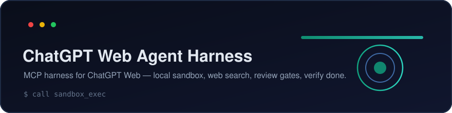

<p align="center">
  
</p>

<p align="center">
  <a href="https://github.com/tanhaien/chatgpt-web-agent-harness/releases"></a>
  
  
  <a href="LICENSE"></a>
  
  <a href="https://github.com/tanhaien/chatgpt-web-agent-harness/stargazers"></a>
</p>

<p align="center">
  
  
  
  
</p>

---

# 🤖 ChatGPT Web Agent Harness

> **Fullstack MCP harness for ChatGPT Web (Codex Web) — turn ChatGPT's GPT-5.5 into a full-stack local coding agent with Docker sandboxed execution, web search, review gates, and verification.**
>
> Fork of [LongNgn204/local-coding-agent](https://github.com/LongNgn204/local-coding-agent) with `sandbox_exec` for Docker-isolated code execution and dynamic workspace switching.

---

## English

### Quick Start

#### Prerequisites
- Node.js ≥ 20
- OpenCode CLI with a configured model/provider (required for `delegate_task` with `start: true`)
- OpenCode MCP configuration (required for the specialist Multi-MCP Gateway)
- Docker (optional, for `sandbox_exec`)
- Tailscale (optional, for private remote MCP/dashboard access)
- A ChatGPT Plus subscription ($20/mo — free GPT-5.5 with Codex Web)

#### Setup (5 minutes)

```bash
# 1. Clone
git clone https://github.com/tanhaien/chatgpt-web-agent-harness.git
cd chatgpt-web-agent-harness

# 2. Install server + durable SQLite orchestration dependencies
bash install.sh

# 3. Configure
cp .env.example server/.env
# Edit server/.env: set AGENT_WORKSPACE and optional auth/origin settings

# 4. Start the tunnel
bash scripts/start-tunnel.sh
# Follow the URL to authorize → OpenAI opens a tunnel to your machine

# 5. Open ChatGPT Web (chatgpt.com/codex)
# → Connect MCP server → tools appear automatically
```

#### Verify it works

```bash
# MCP server health (port 8787)
curl http://localhost:8787/healthz

# Dashboard (port 8790)
open http://localhost:8790/ui  # or browse to it manually
```

In ChatGPT Codex, call `ping` or `workspace_info` to confirm the connection.

---

### Architecture

```
┌─────────────────────────────────────────────────────────┐
│                 ChatGPT Web (Codex Web)                  │
│              GPT-5.5 inference — FREE in $20/mo          │
│           Plans → Codes → Reviews → Verifies             │
└────────────────────────┬────────────────────────────────┘
                         │ OpenAI Secure MCP Tunnel
                         ▼
┌─────────────────────────────────────────────────────────┐
│             LCA MCP Server  (server/server.mjs)          │
│             Node.js · port 8787 · Zod schemas            │
├─────────────────────────────────────────────────────────┤
│  Tools:                                                  │
│  · ping           — health check                         │
│  · read_file      — read file with offset/limit          │
│  · write_file     — write entire file                    │
│  · run_commands   — batch commands (up to 12)            │
│  · search_text    — ripgrep-backed content search        │
│  · web_search     — DuckDuckGo search (no API key)      │
│  · web_fetch      — URL content → markdown              │
│  · git_status/diff— git operations                       │
│  · sandbox_exec   — Docker-isolated code execution      │
│  · set_workspace  — switch repo without restart          │
│  · delegate_task  — persist a durable delegated task     │
│  · task_status    — project current durable status       │
│  · task_events    — cursor/long-poll lifecycle events    │
│  · task_wait      — wait for terminal task state         │
│  · verify_done    — evidence gate                        │
│  · quality_gate   — lint/test/build gate                │
│  · workspace_*    — snapshot, doctor, info              │
│  · skills/policy  — project conventions & rules          │
└─────────────────────────────────────────────────────────┘
```

---

### What makes this different from plain Codex Web?

| Capability | Codex Web only | Codex Web + LCA Harness |
|---|---|---|
| Local file system | ❌ | ✅ Full read/write/patch |
| Docker sandbox exec | ❌ | ✅ `sandbox_exec` (this fork) |
| Web search | ❌ | ✅ DuckDuckGo (free, no API key) |
| Code review gate | ❌ | ✅ `verify_done` evidence gate |
| MCP routing | ❌ | ✅ Native stdio MCP |
| Dynamic workspace switch | ❌ | ✅ `set_workspace` (this fork) |
| Durable task control plane | ❌ | ✅ SQLite events, status, wait and SSE |
| Real autonomous executor | ❌ | ✅ Loopback OpenCode HTTP sidecar |
| Multi-MCP routing | ❌ | ✅ Specialist providers ranked by tool-attention |

---

### What's in this fork (v2.9+)

- **sandbox_exec** — Docker-isolated code execution (pytest, npm test, cargo build, etc.)
- **set_workspace** — switch repo at runtime, no restart needed
- **AGENTS.md** — structured agent workflow playbook
- **verify_done** — formal evidence gate for task completion
- **Durable orchestration** — workspace-scoped SQLite event store, supervisor, task status/wait APIs and dashboard SSE
- **Multi-MCP Gateway** — connects specialist MCPs behind four stable tools; `tool-attention` ranks the private tool inventory
- **Real OpenCode executor** — `delegate_task` with `start: true` launches a loopback OpenCode HTTP sidecar and persists tool-call lifecycle events

---

### Full Tool Reference

#### Added by this fork
| Tool | Description |
|---|---|
| `sandbox_exec` | Run code in Docker container — isolated, repeatable |
| `set_workspace` | Switch workspace repo dynamically |
| `delegate_task` | Persist a durable task; queue-only unless `start: true` |
| `task_status` | Read the projected current task status |
| `task_events` | Page or long-poll ordered lifecycle events |
| `task_wait` | Wait for terminal status or timeout |
| `gateway_list_providers` | List connected specialist MCP providers and health |
| `gateway_find_tools` | Rank the private MCP tool inventory with `tool-attention` |
| `gateway_call` | Invoke one specialist tool through policy/timeout/circuit controls |
| `gateway_health` | Inspect provider health, queues, counters, and circuit state |

#### Built-in (from LCA core)
| Tool | Description |
|---|---|
| `ping` | Health check |
| `read_file` / `write_file` | File read/write |
| `run_commands` | Batch command execution (up to 12) |
| `search_text` | Ripgrep-backed content search |
| `web_search` / `web_fetch` | Web research (DuckDuckGo) |
| `git_status` / `git_diff` | Git operations |
| `verify_done` | Verification with evidence gate |
| `quality_gate` | Lint/test/build gate |
| `workspace_info` / `workspace_snapshot` / `workspace_doctor` | Workspace introspection |
| `list_skills` / `policy_status` | MCP metadata |

---

### Durable orchestration

The server exposes four MCP tools backed by a workspace-scoped SQLite event store:

```json
// delegate_task
{
  "goal": "Review authentication and run the related tests",
  "role": "executor",
  "acceptanceCriteria": ["Find the cause", "Relevant tests pass"],
  "risk": "safe-write",
  "maxToolCalls": 30,
  "timeoutMs": 600000,
  "idempotencyKey": "auth-review-001"
}
```

Use the returned `taskId` with:

- `task_status` — current projected state.
- `task_events` — ordered cursor pagination (`afterSequence`, `limit`) or long polling (`waitMs`).
- `task_wait` — wait for `completed`, `blocked`, `failed`, or `cancelled`.
- Dashboard SSE — `GET /api/task-events?taskId=...&afterSequence=-1&limit=100&heartbeatMs=15000`.

Task history survives server restarts and is isolated per workspace. Reusing the same `idempotencyKey` returns the original task without duplicating lifecycle events.

> **Executor status:** `start: false` leaves a durable task queued. `start: true` runs a real loopback OpenCode HTTP sidecar, maps the requested role to an OpenCode agent (`executor` → `build`, `planner` → `plan`), captures tool-call events, reads the final diff, and persists `completed`, `blocked`, or `failed`. Set `LCA_ORCHESTRATION_EXECUTOR=blocked` only for CI, emergency fallback, or machines without OpenCode.

### Multi-MCP Gateway

The server does **not** expose all specialist tools directly to ChatGPT. It keeps the inventory private and exposes four stable gateway tools:

```text
ChatGPT
   │
   ├─ gateway_find_tools ──► tool-attention ranks the private tool inventory
   │
   └─ gateway_call ────────► timeout / FIFO / health / circuit / policy
                                   │
             ┌─────────────────────┼────────────────────────┐
             ▼                     ▼                        ▼
         contextplus       code-review-graph          codebase-memory
         mempalace         lightpanda                 tool-attention
         vibe-trading      vn-data
```

The default allowlist is:

```text
contextplus,code-review-graph,lightpanda,mempalace,tool-attention,
vibe-trading,vn-data,codebase-memory-mcp
```

`gateway_find_tools` defaults to `maxRisk: "read"`. Under `policy=strict`, only read tools can run. Under `policy=balanced`, `risky` and `critical` gateway calls require an exact one-time approval such as `gateway_call:lightpanda/click`.

### Private access with Tailscale

Keep both Node servers on loopback and proxy them inside your tailnet:

```bash
# MCP
sudo tailscale serve --bg --https=8443 http://127.0.0.1:8787

# Dashboard
# Also set DASHBOARD_ALLOWED_ORIGINS=https://YOUR-NODE.YOUR-TAILNET.ts.net:8444
sudo tailscale serve --bg --https=8444 http://127.0.0.1:8790
```

Then use:

```text
https://YOUR-NODE.YOUR-TAILNET.ts.net:8443/mcp
https://YOUR-NODE.YOUR-TAILNET.ts.net:8444/ui
```

Set `MCP_AUTH_TOKEN` when more than one trusted user/device can reach the node. Do not bind the MCP server to `0.0.0.0` unless you also enforce a firewall and bearer authentication.

---

### Workflow

```
EVERY non-trivial task:
  1. Plan the task with the user → structured plan
  2. Present → wait for confirmation
  3. For each sub-task:
     a. Edit code (read_file → write_file)
     b. Run tests via sandbox_exec (NOT execute_command)
     c. Fix failures (max 3 retries)
     d. Review changes before moving on
  4. Call verify_done with evidence
  5. Report: DONE ✅ or BLOCKED ❌ with reason
```

---

### AGENTS.md

This repo includes an `AGENTS.md` — a playbook for AI coding agents (ChatGPT Codex, Claude Code, Cursor). It enforces:

- Plan-then-execute workflow
- Tool selection guide (which tool for which job)
- Never use `execute_command` for tests — always `sandbox_exec`
- Never claim done without `verify_done`
- Anti-patterns checklist

To use: the agent reads `AGENTS.md` at workspace start.

---

### Safety Defaults

- All dangerous operations require explicit approval
- `sandbox_exec` runs in Docker — host system is isolated
- `execute_command` restricted to safe commands (echo, ls, mkdir)
- Audit log at `server/data/audit.log`
- Workspace-isolated state/backup/approval files

---

### Development

```bash
# Install dependencies
npm ci --prefix server
npm ci --prefix packages/event-store

# Start dev server with auto-reload
node --watch server/server.mjs

# Run server suites
npm --prefix server run test:agent
npm --prefix server run test:hardening
npm --prefix server run test:orchestration
npm --prefix server run test:mcp-gateway-runtime
npm --prefix server run test:mcp-gateway-server
npm --prefix server run test:opencode-executor

# Run package suites
for p in contracts event-store supervisor omo-adapter task-stream controller mcp-gateway; do
  npm test --prefix "packages/$p"
done

# Build Windows tray app
cd tray-app && dotnet publish -c Release
```

#### Project Structure

```
├── server/                    # MCP server, dashboard and runtime composition
│   ├── server.mjs             # Main entry point
│   ├── orchestration-runtime.mjs
│   ├── opencode-executor.mjs
│   ├── mcp-provider-runtime.mjs
│   └── data/                  # Metrics, audit logs and workspace DBs
├── packages/                  # Contracts, event store, supervisor, streams,
│                              # OMO adapter, controller and Multi-MCP gateway
├── scripts/                   # Tunnel client, setup scripts
├── docs/             # Documentation, banner SVG
├── AGENTS.md         # AI agent playbook
└── LICENSE           # AGPL-3.0
```

---

### License

AGPL-3.0 — see [LICENSE](LICENSE).

---

## Tiếng Việt

### Bắt Đầu Nhanh

```bash
# 1. Clone repo
git clone https://github.com/tanhaien/chatgpt-web-agent-harness.git
cd chatgpt-web-agent-harness

# 2. Cài server và dependency SQLite orchestration
bash install.sh

# 3. Cấu hình
cp .env.example server/.env
# Sửa server/.env: đặt AGENT_WORKSPACE và auth/origin nếu cần

# 4. Chạy tunnel
bash scripts/start-tunnel.sh
# Theo URL → OpenAI mở tunnel đến máy bạn

# 5. Mở ChatGPT Web (chatgpt.com/codex)
# → Kết nối MCP → tools xuất hiện
```

### Kiến Trúc

```
ChatGPT Web (Codex Web)  ← OpenAI Tunnel
        │
        ▼
  LCA MCP Server (port 8787)
        │
        ├── 📁 File ops (read/write)
        ├── 🐳 Docker sandbox (sandbox_exec)
        ├── 🌐 Web search (DuckDuckGo)
        └── ✅ Review + verify gates
```

### Tính Năng Chính

| Tính năng | Mô tả |
|---|---|
| `sandbox_exec` | Chạy code trong Docker — cô lập, an toàn |
| `set_workspace` | Chuyển repo workspace không cần restart |
| `delegate_task` | Tạo task bền vững trong SQLite theo workspace |
| `task_status` / `task_events` / `task_wait` | Xem trạng thái, event và chờ terminal |
| Dashboard SSE | Theo dõi lifecycle task theo thời gian thực |
| `gateway_find_tools` | Nhờ `tool-attention` chọn đúng MCP chuyên dụng |
| `gateway_call` | Gọi MCP qua timeout, queue, policy và circuit breaker |
| OpenCode executor | `start: true` chạy agent thật và ghi lại tool events |
| AGENTS.md | Playbook cho AI agent — workflow chuẩn |
| `verify_done` | Evidence gate |

### Dùng Durable Orchestration

Tạo task bằng `delegate_task`:

```json
{
  "goal": "Kiểm tra module authentication và chạy test liên quan",
  "role": "executor",
  "acceptanceCriteria": ["Xác định nguyên nhân", "Test pass"],
  "risk": "safe-write",
  "maxToolCalls": 30,
  "timeoutMs": 600000,
  "idempotencyKey": "auth-check-001"
}
```

Sau đó dùng `task_status`, `task_events` hoặc `task_wait` với `taskId` trả về. Task được lưu qua restart và tách biệt khi đổi workspace bằng `set_workspace`.

Executor mặc định hiện là `opencode-http`: `start: false` giữ task ở `queued`; `start: true` khởi chạy OpenCode sidecar trên loopback, dùng model cấu hình, thực thi task, lấy diff và ghi đầy đủ event. Chỉ đặt `LCA_ORCHESTRATION_EXECUTOR=blocked` cho CI, chế độ khẩn cấp hoặc máy chưa cài OpenCode.

### Dùng Multi-MCP Gateway

Luồng khuyến nghị:

```text
1. gateway_list_providers  → xem các MCP đang kết nối
2. gateway_find_tools      → mô tả nhu cầu; tool-attention xếp hạng tool
3. gateway_call            → gọi canonical tool ID đã chọn
4. gateway_health          → xem health/circuit/counters khi có lỗi
```

Các MCP mặc định gồm `contextplus`, `code-review-graph`, `codebase-memory-mcp`, `mempalace`, `lightpanda`, `tool-attention`, `vibe-trading` và `vn-data`. ChatGPT không phải nhận toàn bộ schema của hơn 100 tool cùng lúc; chỉ kết quả tìm kiếm phù hợp được trả về.

### Mở riêng qua Tailscale

```bash
# MCP trong tailnet
sudo tailscale serve --bg --https=8443 http://127.0.0.1:8787

# Dashboard trong tailnet
# server/.env: DASHBOARD_ALLOWED_ORIGINS=https://TEN-MAY.TAILNET.ts.net:8444
sudo tailscale serve --bg --https=8444 http://127.0.0.1:8790
```

Truy cập `https://TEN-MAY.TAILNET.ts.net:8443/mcp` và `https://TEN-MAY.TAILNET.ts.net:8444/ui`. Nên đặt `MCP_AUTH_TOKEN` nếu tailnet có nhiều người dùng.

### An Toàn

- Mọi thao tác nguy hiểm cần approval
- `sandbox_exec` chạy trong Docker — cách ly hoàn toàn với host
- `execute_command` CHỈ dùng lệnh an toàn (echo, ls, mkdir)
- Audit log tại `server/data/audit.log`

### Giấy Phép

AGPL-3.0 — xem [LICENSE](LICENSE).

---

<p align="center">
  <sub>Built on <a href="https://github.com/LongNgn204/local-coding-agent">LongNgn204/local-coding-agent</a> · AGPL-3.0</sub>
</p>
