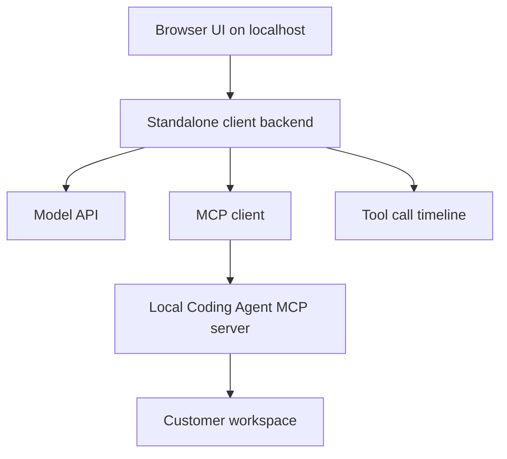
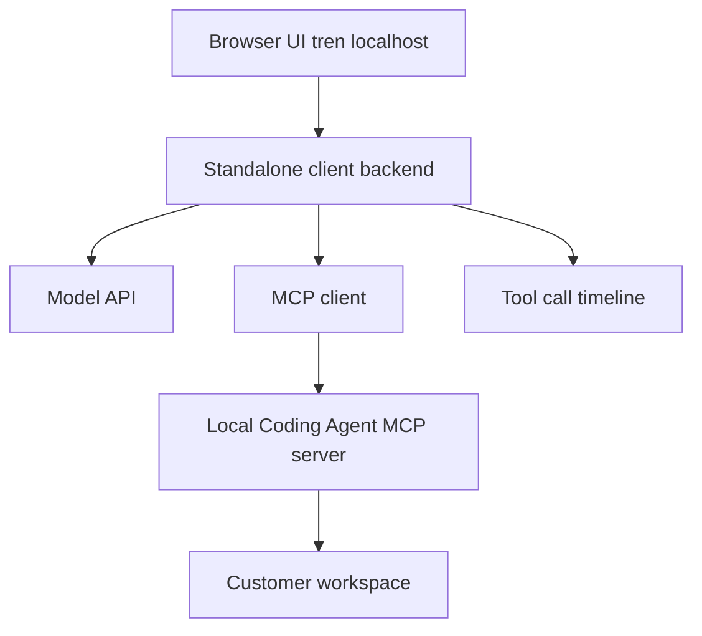

# Standalone Client Roadmap

## English

This experiment tracks the path from `v4.4.0-pro` to `v5.0.0`: moving from a
ChatGPT Web connector-first experience toward a standalone local AI coding
client that can run without GPT Web.

The existing Local Coding Agent MCP server remains the tool engine. The new
client is a separate local app that:

1. connects to the MCP server at `http://127.0.0.1:8787/mcp`,
2. talks to a model API directly,
3. runs the model/tool loop locally,
4. shows chat, tool calls, and diagnostics in its own UI.

## Version Folders

| Folder | Goal | Status |
|---|---|---|
| `v4.5.0-pro-local-client-mvp/` | Standalone local web client with OpenAI Responses API + MCP tool loop. | Runnable + EXE |
| `v4.6.0-pro-model-router/` | OpenAI, Anthropic, and Ollama model adapters with presets and retry handling. | Runnable + EXE |
| `v4.7.0-pro-workspace-profiles/` | Local profile CRUD, activation, redacted export, workspace/model/policy settings. | Runnable + EXE |
| `v4.8.0-pro-agent-studio-ui/` | Tool timeline, approvals, skills, metrics, file viewer, and Git diff controls. | Runnable + EXE |
| `v4.9.0-pro-packaging/` | Managed MCP start/stop, support bundle, and Windows launcher packaging. | Runnable + EXE |
| `v5.0.0-local-agent-studio/` | Combined Studio runtime with profiles, skills, diagnostics, approvals, packaging, and guarded update. | Runnable + EXE |

`shared/standalone-app.mjs` is the canonical runtime. `build-all.ps1` copies it
into every version folder so each folder keeps its own complete runtime,
package, lockfile, entry point, manifest, port, feature flags, and EXE.

## Architecture



## Safety Direction

- The standalone client does not replace server-side safety.
- The MCP server still owns root confinement, command policy, approvals, and
  audit logging.
- The client should show tool calls clearly and prefer `safe` + `balanced`.
- Secrets must stay in environment variables or local untracked config.

## First Run

Start the existing MCP server first:

```powershell
scripts\lca.cmd start --no-tunnel
```

Then run the first standalone MVP:

```powershell
cd experiments\standalone-client-roadmap\v4.5.0-pro-local-client-mvp
npm install
$env:OPENAI_API_KEY="sk-proj-..."
npm start
```

Open:

```text
http://127.0.0.1:5177
```

## Windows EXE

Build every version and copy a self-contained .NET launcher into each version:

```powershell
powershell -ExecutionPolicy Bypass -File experiments\standalone-client-roadmap\build-all.ps1
```

Then double-click:

```text
<version-folder>\dist\LocalAgentStudio.exe
```

Every version folder receives its own launcher and can be tested independently.
The launcher still requires Node.js 18+ because it starts the version's Node
runtime. If `node_modules` is missing, it runs `npm install` before startup.

Model credentials remain optional until chat is used:

```powershell
$env:OPENAI_API_KEY="..."
$env:ANTHROPIC_API_KEY="..."
$env:OLLAMA_BASE_URL="http://127.0.0.1:11434"
```

## Tieng Viet

Thu muc thu nghiem nay ghi lai lo trinh tu `v4.4.0-pro` len `v5.0.0`: chuyen
tu cach uu tien ChatGPT Web connector sang mot local AI coding client rieng,
co the chay ma khong can GPT Web.

MCP server hien tai cua Local Coding Agent van la engine chay tool. Client moi
la mot app local rieng:

1. ket noi MCP server tai `http://127.0.0.1:8787/mcp`,
2. goi model API truc tiep,
3. tu chay vong lap model/tool o may local,
4. hien thi chat, tool calls va chan doan trong UI rieng.

## Cac Thu Muc Phien Ban

| Thu muc | Muc tieu | Trang thai |
|---|---|---|
| `v4.5.0-pro-local-client-mvp/` | Local web client rieng voi OpenAI Responses API + MCP tool loop. | Chay duoc + EXE |
| `v4.6.0-pro-model-router/` | Adapter OpenAI, Anthropic va Ollama voi preset va retry. | Chay duoc + EXE |
| `v4.7.0-pro-workspace-profiles/` | CRUD/activate/export profile, workspace, model va policy settings. | Chay duoc + EXE |
| `v4.8.0-pro-agent-studio-ui/` | Timeline, approvals, skills, metrics, file viewer va Git diff. | Chay duoc + EXE |
| `v4.9.0-pro-packaging/` | Start/stop MCP, support bundle va Windows launcher. | Chay duoc + EXE |
| `v5.0.0-local-agent-studio/` | Ban tong hop profiles, skills, diagnostics, approvals, packaging va update. | Chay duoc + EXE |

## Kien Truc



## Huong An Toan

- Standalone client khong thay the lop an toan ben server.
- MCP server van quan ly root confinement, command policy, approvals va audit log.
- Client nen hien ro tool calls va uu tien `safe` + `balanced`.
- Secret phai nam trong environment variables hoac local config khong commit.

## Chay Thu Lan Dau

Khoi dong MCP server hien tai truoc:

```powershell
scripts\lca.cmd start --no-tunnel
```

Sau do chay standalone MVP dau tien:

```powershell
cd experiments\standalone-client-roadmap\v4.5.0-pro-local-client-mvp
npm install
$env:OPENAI_API_KEY="sk-proj-..."
npm start
```

Mo:

```text
http://127.0.0.1:5177
```

## Windows EXE

Build tat ca version va copy launcher vao tung folder:

```powershell
powershell -ExecutionPolicy Bypass -File experiments\standalone-client-roadmap\build-all.ps1
```

Sau do double-click:

```text
<version-folder>\dist\LocalAgentStudio.exe
```

Moi thu muc phien ban deu co launcher rieng va co the test doc lap. Launcher van
can Node.js 18+ de chay Node runtime cua app. Neu chua co `node_modules`,
launcher se tu chay `npm install`.
